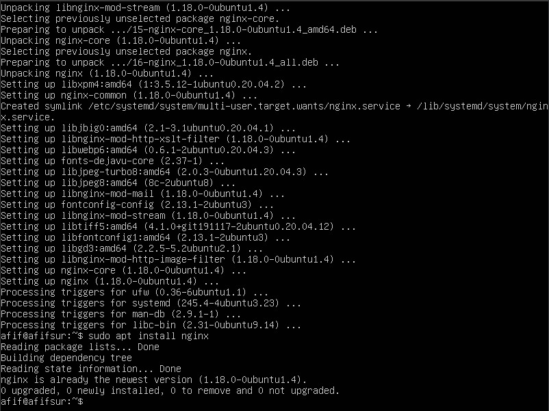
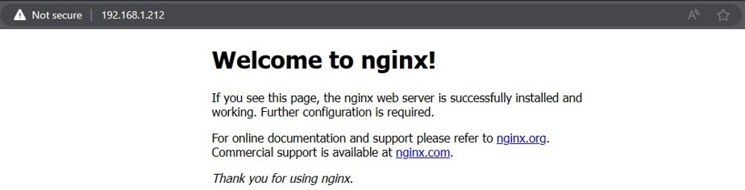
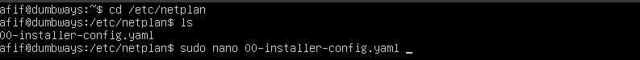
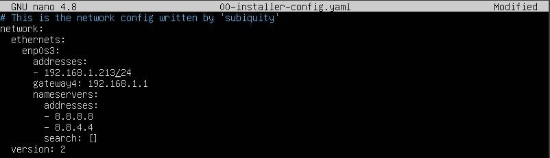
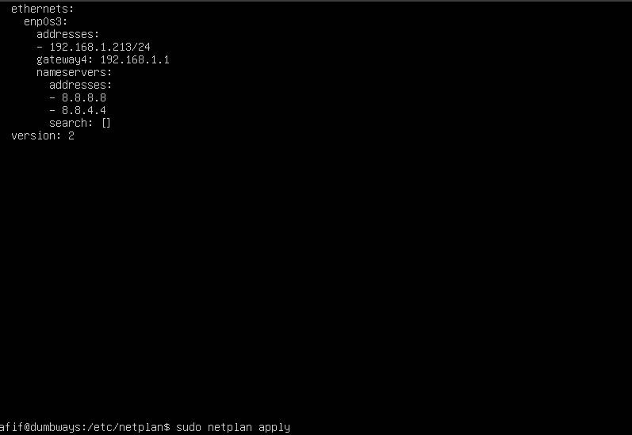
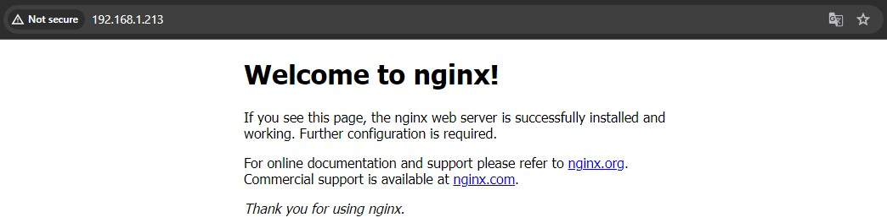
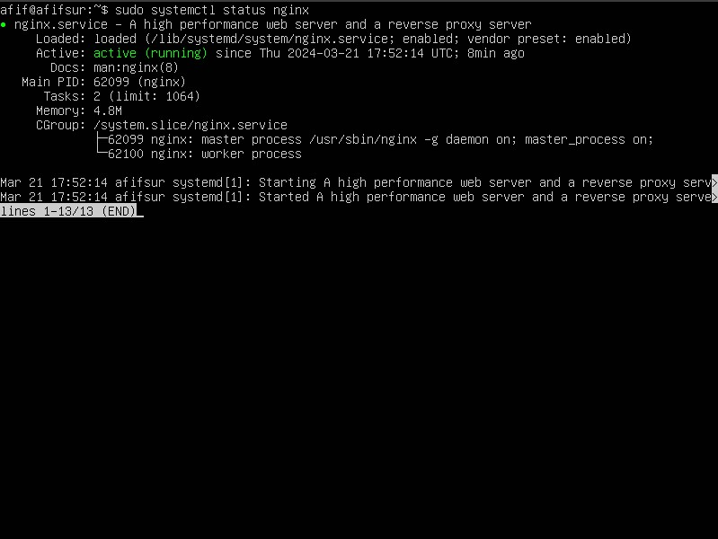

# Operating System & Linux Server

1. Cari perbedaan antara distro Ubuntu dan CentOS!
Ubuntu: berbasis debian, sering update, lebih mudah dipahami pemula.
CentOS: berbasis RHEL, jarang update, lebih susah dipahami pemula.

2. Apa perbedaan dari CLI & GUI?
CLI: Interface berupa teks; tidak user friendly; memerlukan sedikit resource.
GUI: Interface berupa gambar, ikon, dsb; user friendly; memerlukan banyak resource.

3. Di VM masing-masing :
    - Install nginx, lalu akses melalui browser/`curl <ip kalian>`
    

    

    - Ganti IP address kalian (bebas) lalu akses kembali nginx (`/etc/netplan`)
    

    

    

    

4. Terangkan fungsi systemctl dan contoh commandnya (gunakan nginx)

Systemctl berfungsi untuk meng on/off kan ataupun mengecek status suatu layanan
semisal pada contoh diatas adalah untuk cek status nginx aktif atau tidak.
