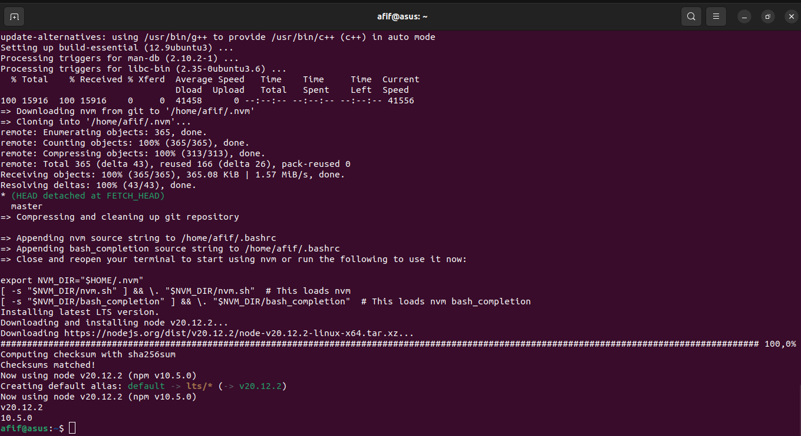

# Challenge

1. Install nodeJS using BASH Script
    - Installing nvm and npm
    - Exec bash
    - Checking nvm, npm, and node version

Kemudian jalankan 'sudo chmod +x nodejs.sh' dan diakhiri dengan './nodejs.sh'

