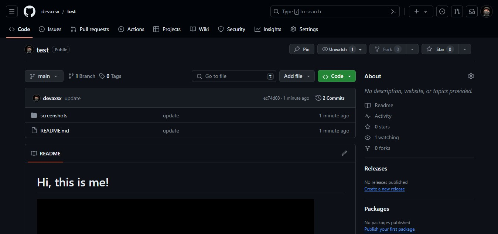

# Git Bash

1. Pastikan sudah terinstall git bash dan sudah memiliki akun git hub

2. Create new repository

3. Copy URL pada repositori baru tersebut agar bisa terhubung dengan local directory

4. Pilih direktori lokal kemudian klik 'git bash here' dan lakukan git clone

5. Pada direktori lokal yang tadinya kosong kemudian terisi sesuai dengan repositori baru pada git hub

6. Kemudian edit clone directory tersebut sesuai kebutuhan misalnya kita ingin menambahkan file

7. Kemudian edit file README.md pada direktori tersebut dan hubungkan dengan foto serta README.md yang ada di folder screenshots

8. Setelah selesai kemudian kembali klik 'git bash here'

9. Pastikan pada akhir clone directory sudah terdapat tulisan 'main' dan kemudian lakukan konfigurasi email serta username git hub kita dan jalankan git init serta git status

10. Kemudian jalankan git add . serta git status untuk crosscheck apakah file terbaru sudah siap untuk diupload ke git hub repository kita

11. Kemudian jalankan git commit dan git push untuk mengupload perubahan dari local repository ke git hub repository kita

12. Terakhir kita bisa melihat apakah sudah ada update pada git hub repository kita atau belum jika sudah berarti setiap step berjalan baik
