# Manage Server with Terminal

1. Buat 3 directory yang masing-masing berisi 2 file dan rapihkan sebaik mungkin!
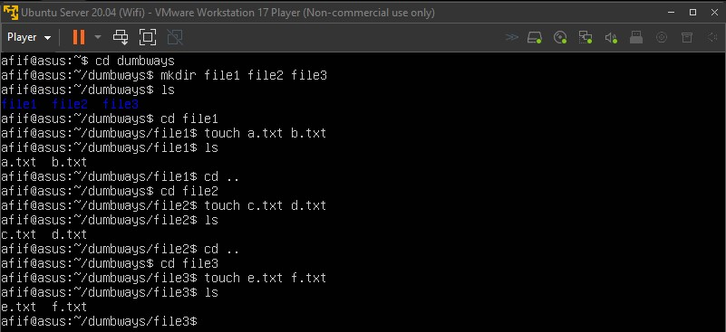

2. Penjelasan text manipulation beserta step by step
    - Echo
    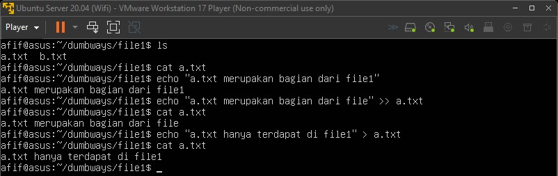
    
    - Sort
    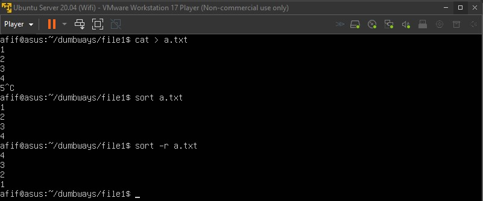

    - Diff
    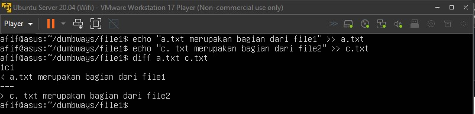

    - Cat
    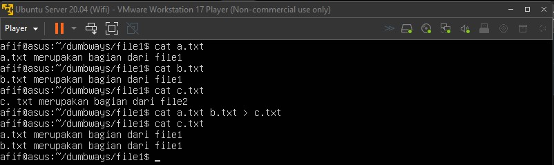

    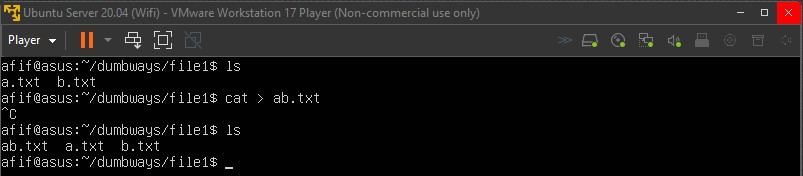

    - Sed
    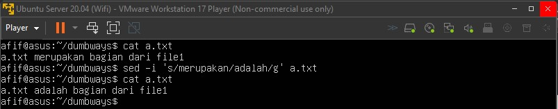

    - Grep
    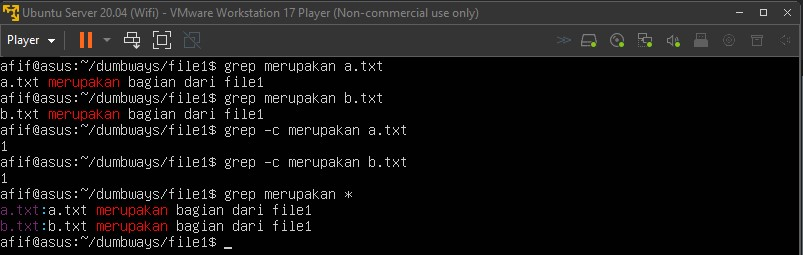

3. Penjelasan tool htop atau nmon
Htop: Perintah monitoring sistem untuk melihat aktivitas cpu, memory, dan swap.
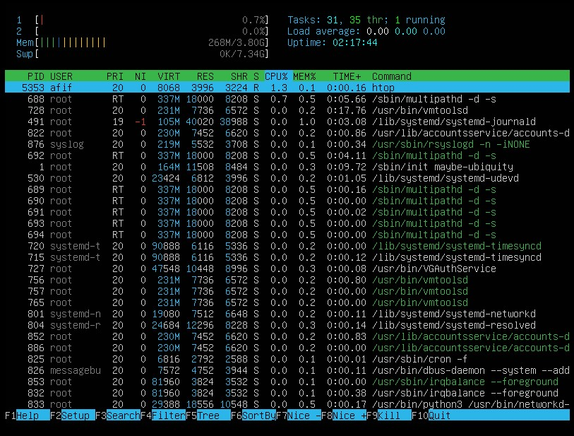

Nmon: Perintah monitoring sistem untuk melihat aktivitas cpu, memory, disk, dan network.
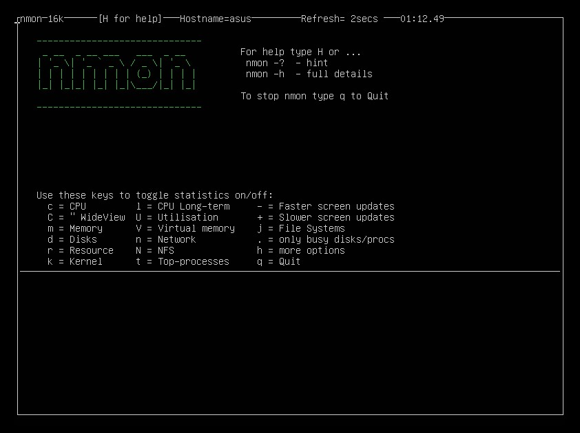

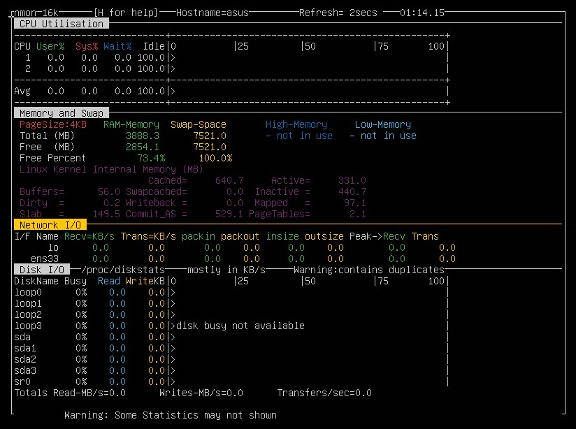

4. Buatlah BASH script untuk instalasi nginx
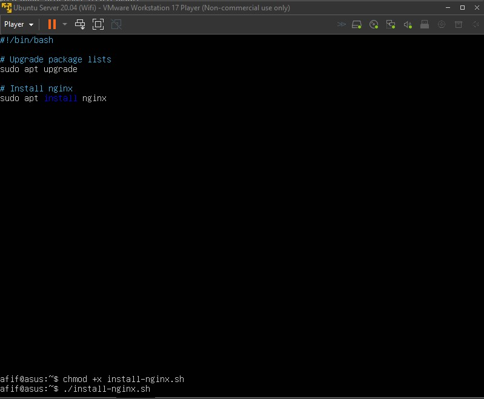

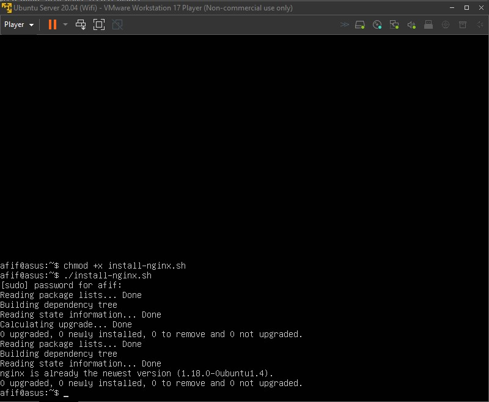