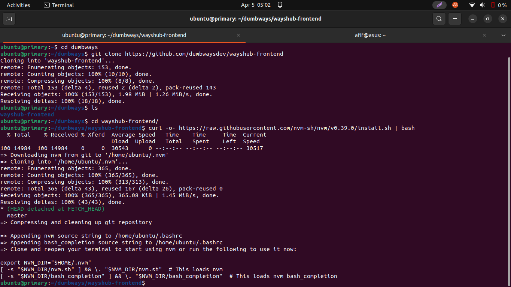
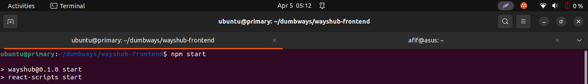
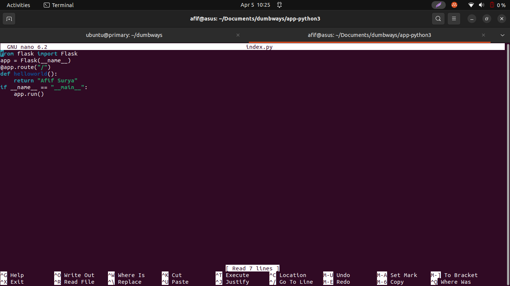

# Task Week 3

## Application in Server

1. Perbandingan antara monolith dengan microservices.
   Mono  : Aplikasi dibangun sebagai satu kesatuan besar yang utuh; Arsitekturnya Lebih sederhana dan cepat dibangun tapi sulit untuk diskala dan dimodifikasi; Arsitekturnya relatif lebih sederhana sehingga budget yang diperlukan relatif lebih rendah.
   Micro : Pendekatan arsitektur aplikasi dengan memecahnya menjadi layanan-layanan kecil yang terpisah; Arsitekturnya Lebih kompleks tapi lebih mudah diskala, dimodifikasi, dan diganti per-layanan; Arsitekturnya relatif kompleks sehingga budget yang diperlukan relatif lebih tinggi.

2. Deploy aplikasi wayshub-frontend (NodeJS) dari repository ``` https://github.com/dumbwaysdev/wayshub-frontend ``` cara run aplikasi `npm start`

   Lakukan git clone pada direkotori lokal dari repositori github wayshub-frontend kemudian masuk ke direktori clone tersebut lalu install trio node (node.js, nvm, dan npm) didalamnya.

   

   

   Setelah prosesnya selesai kita bisa coba jalankan aplikasi dengan perintah npm start

   
   
   

   Terakhir kita dapat cek dari web apakah wayshub-frontend sudah terdeploy atau belum dengan input nomor ip kita:3000 pada web browser

      

3. Deploy golang & python pada nginx dengan menampilkan nama anda.

   Python
   
   Jalankan apt update & upgrade sebelum cek versi python3
   
   
   
   Kemudian masuk kedalam direktori app-python3 dan install python3-pip, pip istall flask, kemudian nano index.py
   
   
   
   
   
   Edit index.py sesuai dengan kebutuhan setelah itu jalankan python3 index.py
   
   
   
   Cek output melalui browser dengan url localhost:5000
   
   
   
   
   Golang
   
   Install golang, cek versi golang, dan buat file index.go pada direktori aplikasi golang
   
   
   
   Edit isi file index.go sesuai kebutuhan
   
   
   
   Terakhir jalankan file index.go untuk melihat output akhir
   
   
   
   
   
   
   
   
   
   
   
   
   
   
   
   
