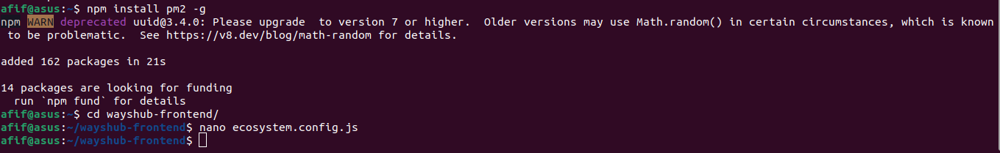
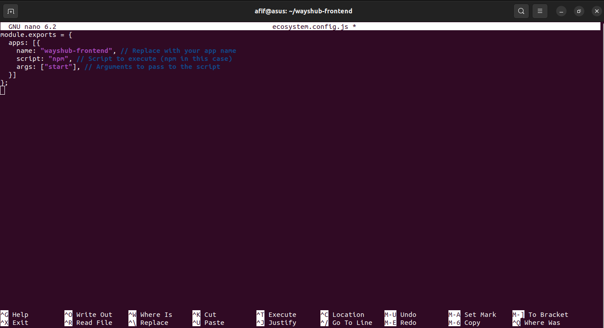
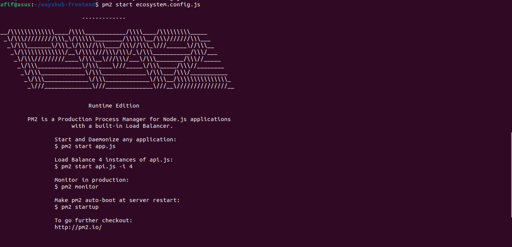
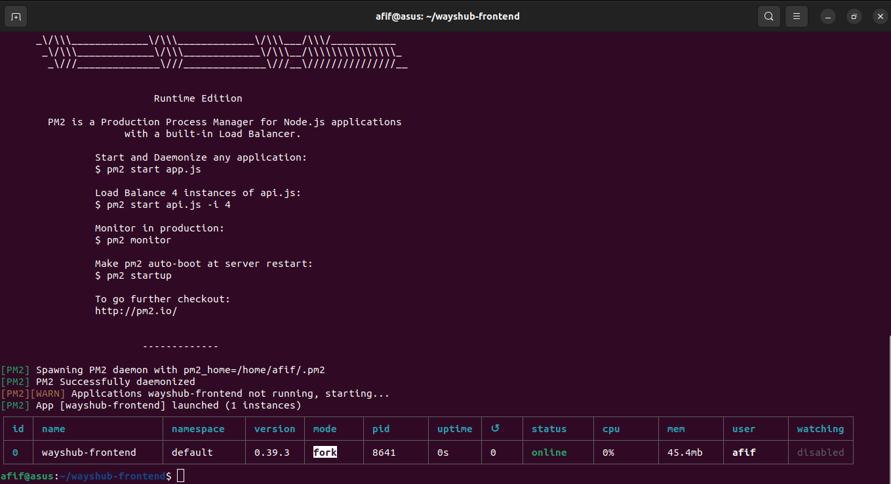
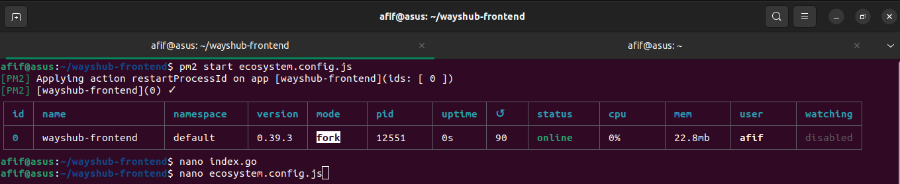
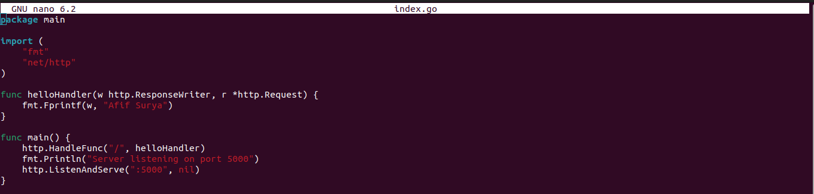
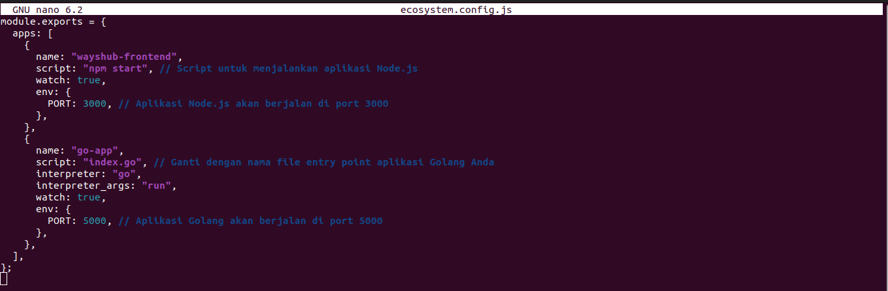
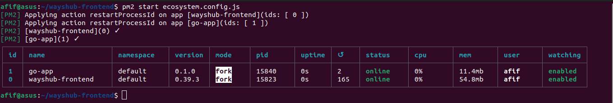
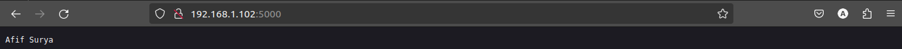

# Task Week 3

## Challenge
1. Deploy aplikasi NodeJS dan Golang di PM2
2. Golang dijalankan pada port 5000 dan bisa diakses melalui web browser

   

   

   

   

   

   

   

   

   
