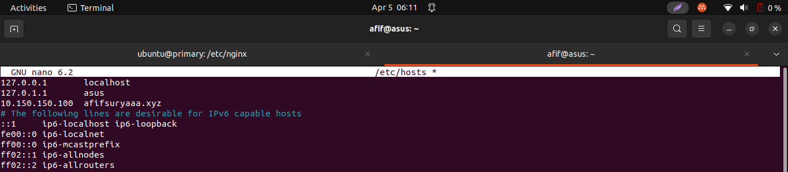
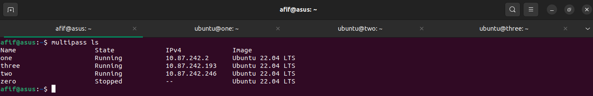
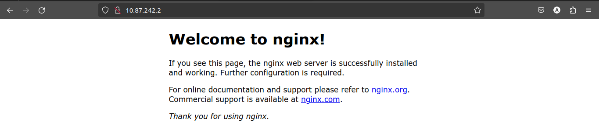

# Task Week 3

## Web Server & Load Balancing

1. Jelaskan apa itu web server dan gambarkan bagaimana cara webserver bekerja.

   Web server itu seperti rumah di internet tempat menyimpan dan menyajikan halaman web. Bayangkan web server seperti pelayan di restoran yang menyajikan makanan kepada pelanggan. Ketika Anda mengetik alamat situs web di peramban web Anda, seperti Google.com, permintaan Anda dikirim ke web server. Web server kemudian menyiapkan halaman web yang diminta dan mengirimkannya kembali ke peramban Anda agar Anda bisa melihatnya.

Proses kerjanya seperti ini: Ketika seseorang meminta halaman web, peramban web mereka mengirim permintaan ke web server. Web server kemudian menemukan halaman yang diminta, seperti halaman depan situs web, mengumpulkannya, dan mengirimkannya kembali ke peramban pengguna. Kemudian peramban web menampilkan halaman web tersebut kepada pengguna.

Jadi intinya, web server adalah tempat di internet tempat halaman web disimpan dan disajikan kepada pengguna saat mereka memintanya.

2. Buatlah reverse proxy untuk aplilkasi wayshub-frontend yang telah di deploy dan untuk domain sesuaikan dengan nama anda ex: alvin.xyz
   
   Cek status nginx kemudian buat direktori baru pada /etc/nginx lalu buat sebuah file konfigurasi reverse proxy
   
   

   
   
   Kembali ke direktori /etc/nginx lalu edit file nginx.conf dengan menambahkan direktori yang berisi file konfigurasi reverse proxy yang telah dibuat
   
   
   
   
   
   Cek apakah file konfigurasi terdapat masalah atau tidak kemudian restart nginx jika tidak ada masalah
   
   
   
   Selanjutnya membuat virtual host dengan kembali ke server lokal untuk mejalankan sudo nano /etc/hosts
   
   
   
   Tambahkan alamat IP serta domain dari reverse proxy yang telah dibuat sebelumnya
   
   
   
   Kemudian kembali masuk ke server reverse proxy untuk menjalankan command npm start pada direktori aplikasi
   
   
   
   Dan akhirnya frontend dari aplikasi wayshub dapat diakses dengan domain afifsuryaaa.xyz pada web
   
   

3. Jelaskan apa itu load balance.

   Suatu proses untuk membantu memastikan situs web tetap stabil dan cepat meskipun ada banyak pengguna yang mengaksesnya dengan cara membagi lalu lintas web ke beberapa server sehingga setiap server tidak terlalu sibuk dan situs web tetap dapat diakses dengan cepat sekalipun banyak yang mengaksesnya.

4. Implementasikan load balancing kepada aplikasi wayshub-frontend yang telah anda gunakan.

   Buat beberapa multipass yang dijadikan sebagai server host dan server aplikasi. Disini saya menggunakan multipass one sebagai server host kemudian multipass two dan three sebagai server dari aplikasi wayshub-frontend yang akan dijalankan untuk implementasi load balancing.

   

   Pastikan nginx pada server host sudah terinstall dan aktif.
   
   

   

   Kemudian jalankan server dari aplikasi wayshub-frontend pada multipass two dan three.

   

   

   

   

   

   

   

   

   Kemudian kembali ke server host, pada direktori /etc/nginx buat direktori baru yang berisi file konfigurasi untuk load balancing atau bisa menggunakan file konfigurasi yang sebelumnya digunakan untuk reverse proxy.

   

   

   Setelah itu edit file nginx.conf pada direktori /etc/nginx dengan menambahkan direktori dari file konfogurasi load balancing yang barusan dibuat pada bagian virtual host configs

   

   

   Kemudian cek apakah file konfigurasi tidak ada error dan apabila sukses bisa reload nginx pada server host.

   

   Kemudian karena pada tahapan reverse proxy telah mengubah konfigurasi pada /etc/hosts dengan menambahkan alamat ip dari sever host serta dns yang digunakan, kita dapat langsung ke tahapan berikutnya yaitu cross check fungsi load balance.
   
   Pada dokumentasi berikut telah dilakukan :
   - Mematikan kedua server aplikasi hasilnya bad gateway
   - Menghidupkan salah satu server aplikasi hasilnya aplikasi berjalan sebagaimana mestinya
   
   Sehingga dapat disimpulkan bahwa fungsi load balancing berjalan dengan baik.

   

   

